<h1 align="center">Animal Match 🐾</h1>

[View the live website here.](https://xnaavii.github.io/milestone2/)

## Project Rationale

This is animal-themed memory game.

<h2 align="center">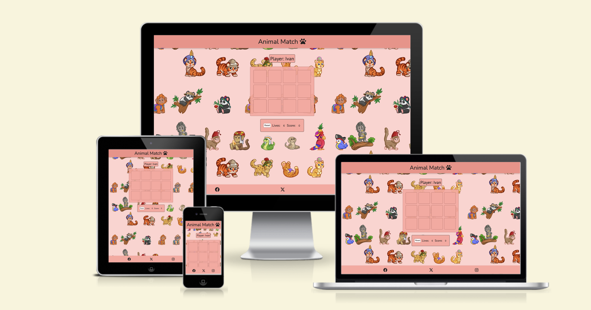</h2>

## CONTENTS

* [User Experience](#user-experience-ux)
  * [User Stories](#user-stories)

* [Design](#design)
  * [Colour Scheme](#colour-scheme)
  * [Typography](#typography)
  * [Imagery](#imagery)
  * [Freeform](#freeform)

* [Features](#features)
  * [General Features on Each Page](#all-pages)
  * [Home Page](#home-page)
  * [About Us Page](#about-us)
  * [Register Page](#register-page)
  * [Sign In](#sign-in)

* [Technologies Used](#technologies-used)
  * [Languages Used](#languages-used)
  * [Frameworks, Libraries & Programs Used](#frameworks-libraries--programs-used)

* [Testing](#testing)
  * [Code Validation](#code-validation)
  * [Accessibility and Performance Test](#accessibility-performance-test)
  * [Feature Testing](#feature-testing)
  * [Browser Support Testing](#browser-support-testing)
  * [Device compatibility](#device-compatibility)
  * [Tools Testing](#tools-testing)

* [Bugs](#bugs)

* [Deployment](#deployment)
  * [Finished Product]()
  * [GitHub Pages](#github-pages)

* [Credits](#credits)
  * [Code](#code)
  * [Content](#content)
  * [Media](#media)
  * [Acknowledgements](#acknowledgements)

## User Experience (UX) <h5>[Back To top](#contents)</h5>

* ### User stories

* #### First Time Visitor Goals

  * As a First Time Visitor, I want to easily understand the main purpose of the site.
  * As a First Time Visitor, I want to be able to easily navigate throughout the site and play the game.

* #### Returning Visitor Goals

  * As a Returning Visitor, I want to see more tiles added.
  * As a Returning Visitor, I want to see high-score board added.

## Design <h5>[Back To top](#contents)</h5>

* ### Colour Scheme

  * The color palette
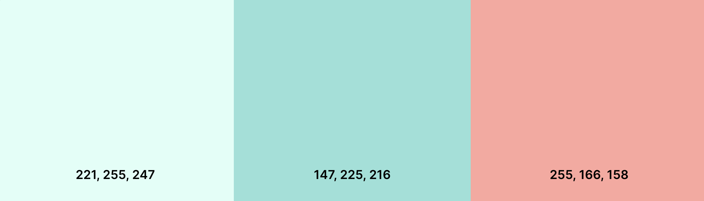

* ### Typography

  * The fonts used are ‘PT Sans' for headings and ‘Nunito’ for text; 'sans-serif' as a fallback font.

* ### Imagery

  * Images were chosen in regard to the topic of the website; meaning that they were chosen to be minimalistic, related to the theme and game idea.

* ### Wireframes

  * No wireframes were made for this project, however idea for this project was created in the freeform app using iPad.
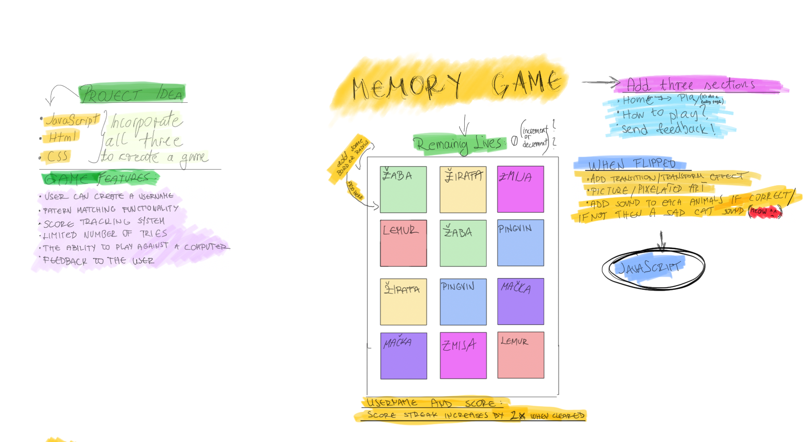  

## Features <h5>[Back To top](#contents)</h5>

* ### Game Container

* 'Welcome' and 'How to play' modal
  * When user loads the page, it will be welcomed and shown how to play with start button underneath.
  * When ready, user can press the start button and input their name in the window prompt (optional).

* Player section
  * Contains ‘Player:’ section on the top and changes according to the user input, no input means that name will be assigned randomly.

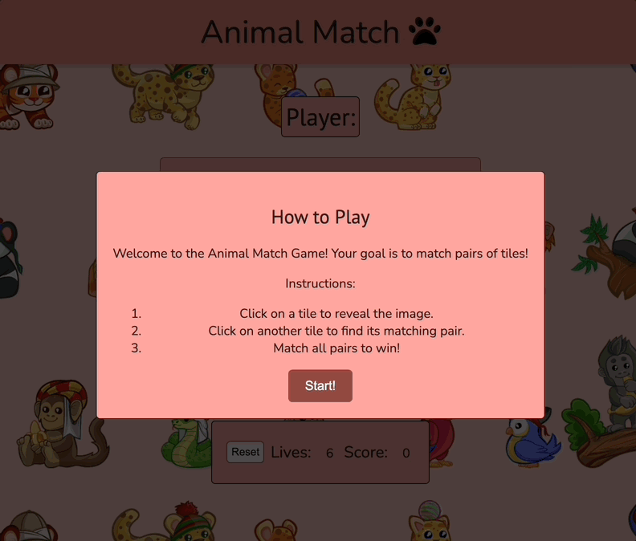

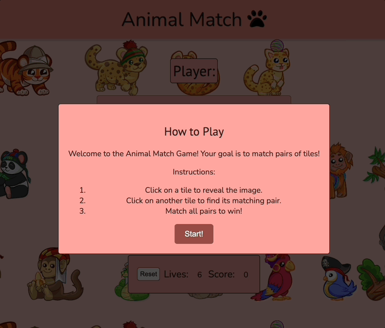

* Game board
  * Contains 12 individual tiles and 6 pairs with all of them containing animal image.
  * Player will start with 6 lives and if all tiles match, final score is 60.
  * In the game, when a player interacts with a tile, it undergoes a 180-degree flip animation. This rotation occurs along the Y-axis, creating a visually engaging effect. The flip animation allows players to reveal the hidden image on the tile and find matching pairs as part of the gameplay.

* Tile match 
  * When tiles match, score will increment by 10, sound will play and tiles will stay visible.

  * When all tiles are paired, player wins and will be congratulated.
  * Happy sound is played wit happy cat gif.

  * If they don't match, they will return to their position and player will lose one life.

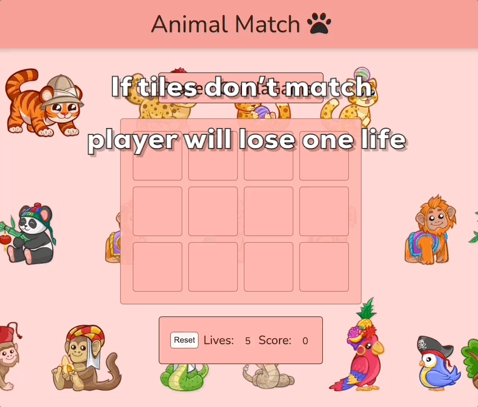

  * When there are no more lives left, player loses the game and has the option to play again.
  * Crying cat sound is played with crying cat gif.

* Reset button
  * When clicked, scores and lives return to their inital state.

* ### Footer

  * The footer offers an array of social media links which when selected, takes user to the desired site.
  * When hovered, icons are expected to change color.

## Technologies Used <h5>[Back To top](#contents)</h5>

### Languages Used

* [HTML5](https://en.wikipedia.org/wiki/HTML5)
* [CSS3](https://en.wikipedia.org/wiki/Cascading_Style_Sheets)
* [JavaScript](https://en.wikipedia.org/wiki/JavaScript)

### Frameworks, Libraries & Programs Used

* [Google Fonts:](https://fonts.google.com/)
  * Google fonts were used to import the ’Nunito’ and ‘PT Sans’ font into the style.css file which is used on all pages throughout the project.
* [Git](https://git-scm.com/)
  * Git was used for version control by utilizing the Gitpod terminal to commit to Git and Push to GitHub.
* [GitHub:](https://github.com/)
  * GitHub is used to store the projects code after being pushed from Git.
* [Freeform](https://en.wikipedia.org/wiki/Freeform_(Apple))
  * Freeform was used to create the project layout during the design process.

## Testing  <h5>[Back To top](#contents)</h5>

### Code Validation

The W3C Markup Validator and W3C CSS Validator Services were used to validate the project page to ensure there were no syntax errors in the project.

* [W3C Markup Validator](https://jigsaw.w3.org/css-validator/#validate_by_input)
  * W3C Markup Validator returned series of warnings which were later resolved.
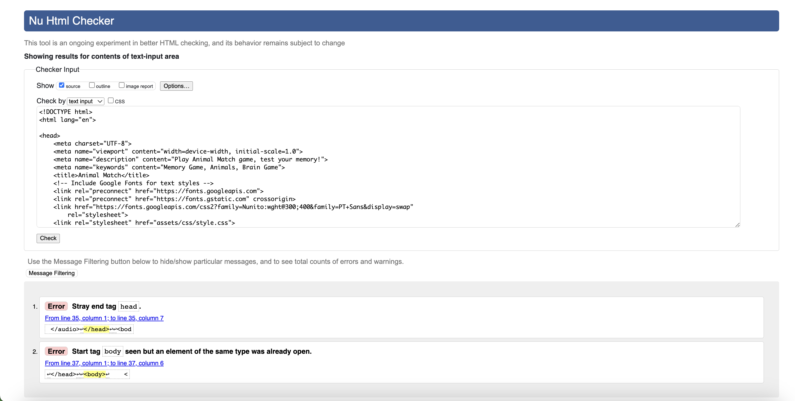
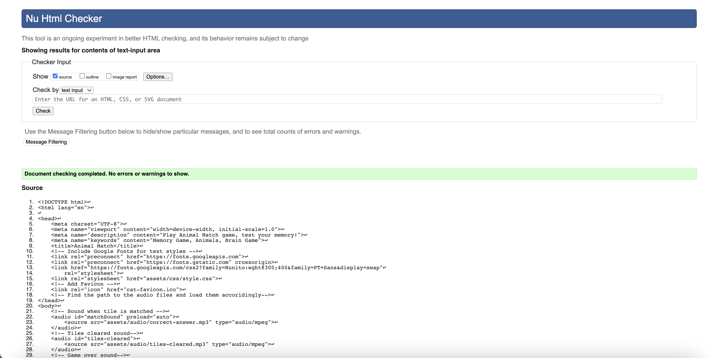
* [W3C CSS Validator](https://jigsaw.w3.org/css-validator/#validate_by_input)
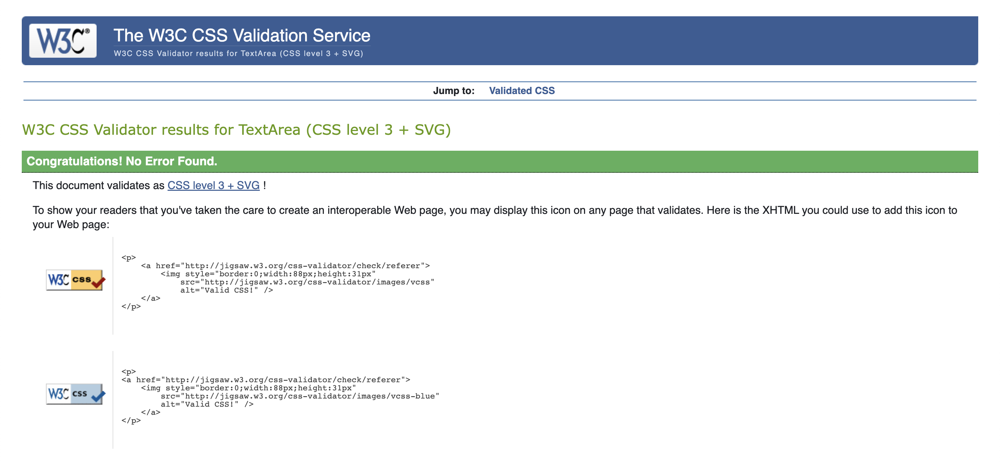
* [JS Hint Validator](https://jshint.com/)
  * JS Hint Validator returned series of warnings which were later resolved.
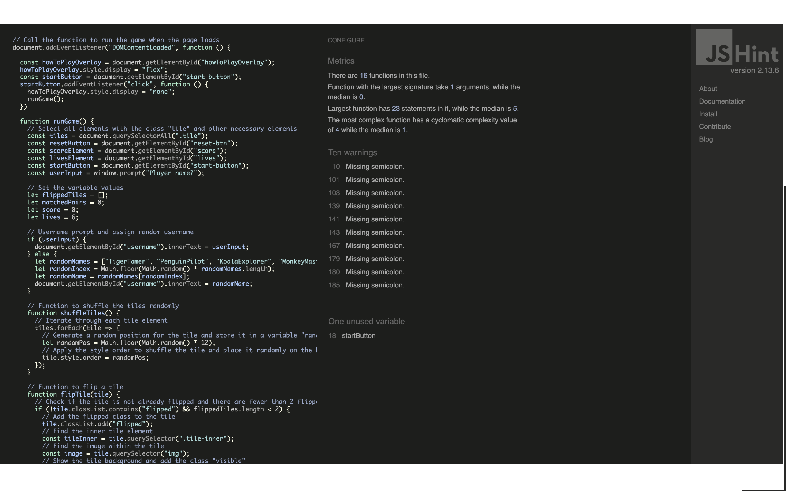
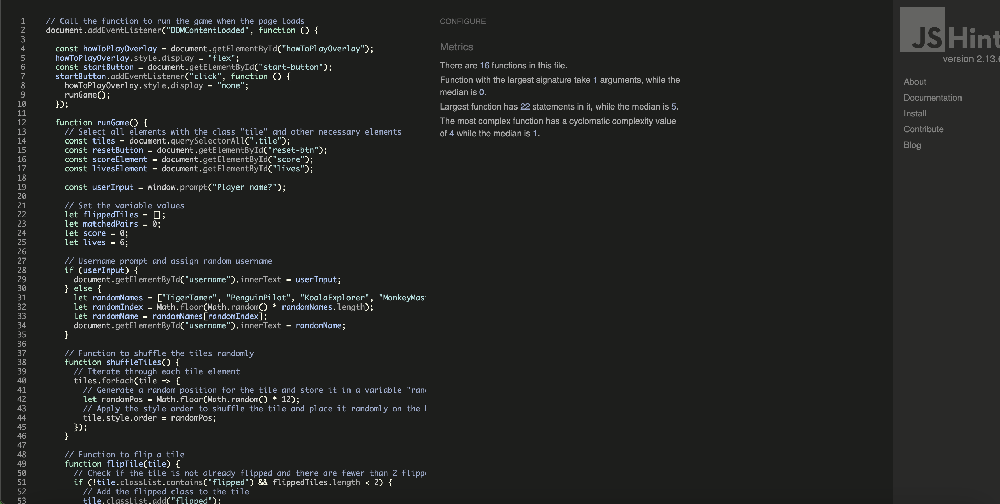

### Accessibility and Performance Test

* Used Lighthouse in Chrome DevTools to confirm that the colours and fonts being used in throughout the website are easy to read and accessible.
* Lighthouse reports
  * Desktop Results
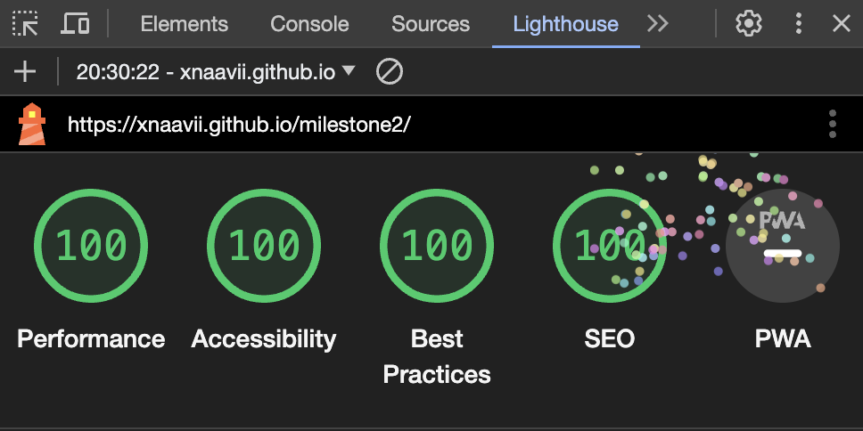
  * Mobile Results
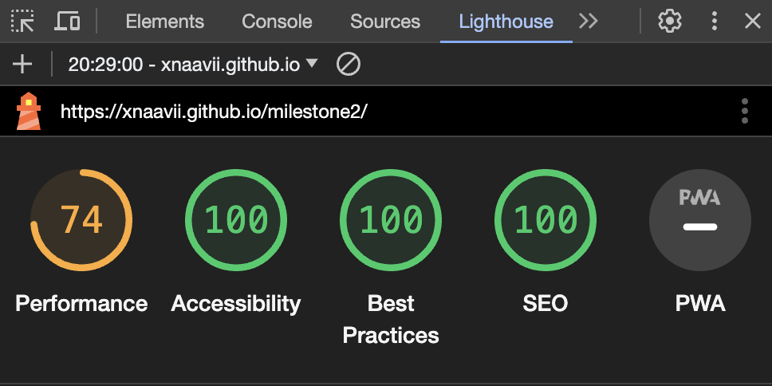

### Feature Testing

* Common Elements Testing

  * General

    Feature | Outcome | Pass/Fail
    --- | --- | ---
    Buttons | Hover effect | Pass
    Footer Social Links | Hover effect and open the specific website in a new tab. | Pass

  * Game Section

    Feature | Outcome | Pass/Fail
    --- | --- | ---
    Tile Flip | Flip a tile when clicked. | Pass
    Tile Match | Play a sound when tiles match. | Pass
    Reset Button | Reset the game and play a sound when the game resets. | Pass
    Victory sound | Play a sound when all tiles match. | Pass
    Defeat sound | Play a sound when lives reach zero. | Pass
    Lives counter | Decrease life if tiles don't match. | Pass
    Score counter | Increase score on tile match | Pass

### Browser Support Testing

| Device/Browser | Expected Performance | Testing Performed | Result |
| --- | --- | --- | --- |
| Google Chrome | Full functionality of external and internal links as well as full functionality of the form element. | Tested all features, links, video and form. | Passed with full functionality. |
|  |  |  |  |
| Safari | Full functionality of external and internal links as well as full functionality of the form element. | Tested all features, links, video and form. | Passed with full functionality. |
|  |  |  |  |
| Internet Explorer | Full functionality of external and internal links as well as full functionality of the form element. | Tested all features, links, video and form. | Passed with full functionality. |
|  |  |  |  |
| Microsoft Edge | Full functionality of external and internal links as well as full functionality of the form element. | Tested all features, links, video and form. | Passed with full functionality. |
|  |  |  |  |

### Device compatibility

Device | Outcome | Pass/Fail
--- | --- | ---
MacBook M2 Air 13.6' | No appearance, responsiveness nor functionality issues. | Pass
HP Chromebook 14' | No appearance, responsiveness nor functionality issues. | Pass
Samsung Galaxy S21 Ultra | No appearance, responsiveness nor functionality issues. | Pass
iPad Air | No appearance, responsiveness nor functionality issues. | Pass
iPad Mini | No appearance, responsiveness nor functionality issues. | Pass
iPhone 12 Mini | No appearance, responsiveness nor functionality issues. | Pass
iPhone 13 Mini | No appearance, responsiveness nor functionality issues. | Pass
iPhone 14 Pro Max | No appearance, responsiveness nor functionality issues. | Pass
iPhone 15 Pro | No appearance, responsiveness nor functionality issues. | Pass

### Tools Testing

* [Chrome DevTools](https://developer.chrome.com/docs/devtools/)

  * Chrome DevTools was used during the development process to test, explore and modify HTML elements and CSS styles used in the project.

## Finished Product <h5>[Back To top](#contents)</h5>

Desktop | Mobile
 --- | ---
 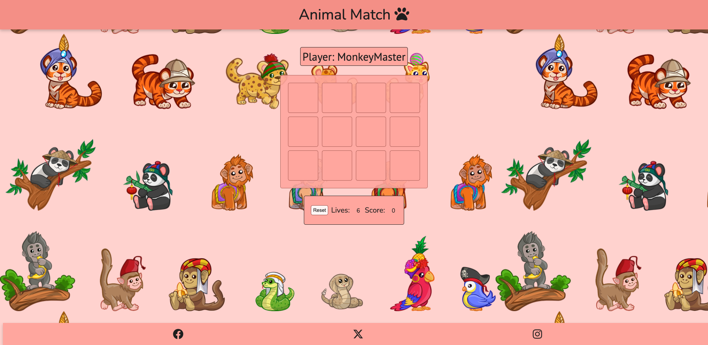 | 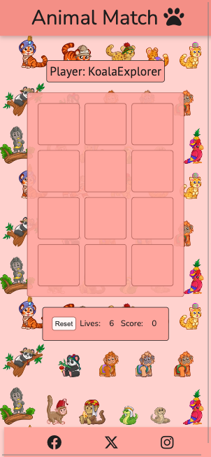

## Deployment <h5>[Back To top](#contents)</h5>

### GitHub Pages

The project was deployed to GitHub Pages using the following steps:

1. Log in to GitHub and locate the GitHub Repository
2. At the top of the Repository (not top of page), locate the "Settings" Button on the menu.
3. Scroll down the Settings page until you locate the "GitHub Pages" Section.
4. Under "Source", click the dropdown called "None" and select "Master Branch".
5. The page will automatically refresh.
6. Scroll back down through the page to locate the now published site in the "GitHub Pages" section.

## Credits <h5>[Back To top](#contents)</h5>

### Code

* [Stack Overflow](https://stackoverflow.com/), [CSS-Tricks](https://css-tricks.com/) and [W3Schools](https://www.w3schools.com/) were consulted on a regular basis for inspiration and sometimes to be able to better understand the code being implement.
* Code was inspired by [dcode](https://www.youtube.com/watch?v=bznJPt4t_4s&t=1242s), [CodingNepal](https://www.youtube.com/watch?v=DABkhfsBAWw&t=848s) and [CodeCreative](https://www.youtube.com/watch?v=mohIQB_70Xk&t=601s). Videos were used for better understanding of JavaScript fundamentals and DOM manipulation.

### Content

* Content was created by the developer.

### Media

* Images, Illustrations, Audios, and GIFs were taken from [Pixabay](https://pixabay.com/).

### Acknowledgements

* My mentor, Marcel, for his invaluable feedback and guidance.

* My friends for their impeccable vision and testing.
